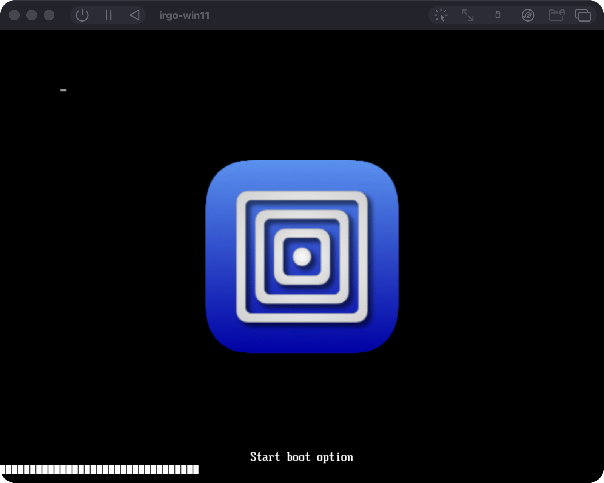
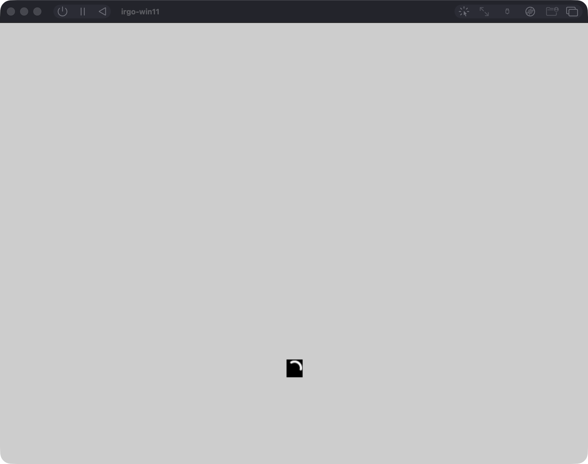
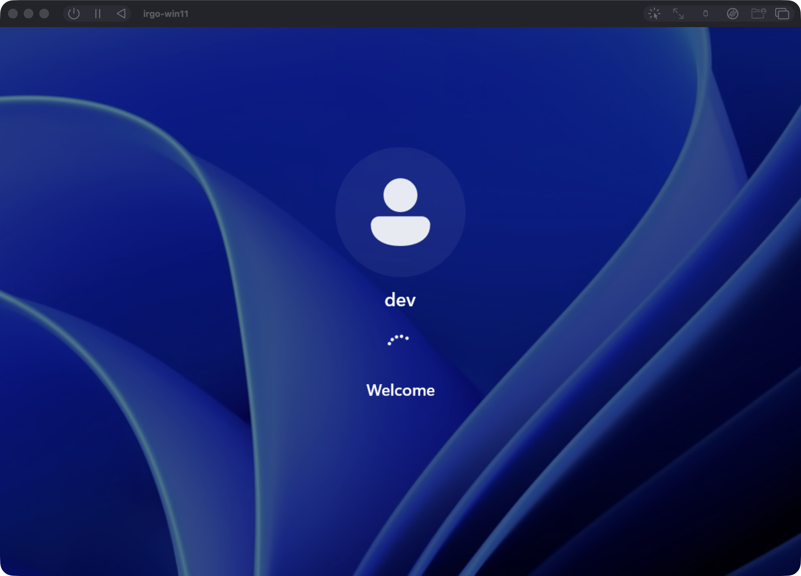
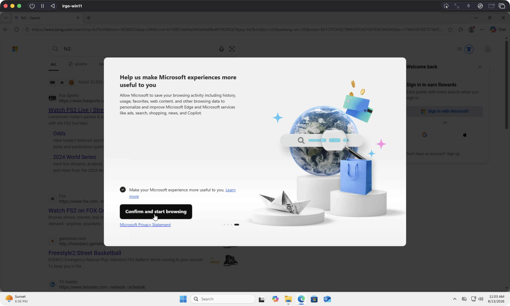

# irgo-windows-vm

<https://github.com/joeblew999/irgo-windows-vm>
· [Docs site](https://joeblew999.github.io/irgo-windows-vm/)

A Windows 11 ARM64 VM on Apple Silicon, and your Go binaries running inside it.

Build on the Mac, run on Windows, read the output back. No GUI, no manual
install, nothing to click.

## Get it

**[All releases →](https://github.com/joeblew999/irgo-windows-vm/releases)** —
every version, with checksums.
The [latest](https://github.com/joeblew999/irgo-windows-vm/releases/latest) is
the one you want.

Download the binary for your Mac — `arm64` for Apple Silicon — then:

```sh
chmod +x irgo-winvm-darwin-arm64
xattr -d com.apple.quarantine irgo-winvm-darwin-arm64
./irgo-winvm-darwin-arm64
```

The second line is macOS refusing anything downloaded from the internet;
without it Gatekeeper reports the binary as damaged.

macOS on Apple Silicon. It installs UTM itself if you do not have it.

## What it is for

This is the VM system for **[Irgo](https://github.com/stukennedy/irgo)** — a
hypermedia-driven framework for building native iOS, Android and **desktop**
apps in Go with Datastar, no JavaScript framework involved.

Desktop is the hard word in that sentence. An app that runs on one desktop is
not a desktop app; it has to work on Windows and Linux as well as on the Mac it
was written on. The desktop half rests on
[glaze](https://github.com/crgimenes/glaze) and
[native](https://github.com/crgimenes/native) — cgo-free Go libraries for a
webview and the OS integration around it — and *"it works on my Mac"* is not
evidence about any of the others.

Windows is the one that cannot be checked by reading the code. It is a
different windowing system, a different webview, a different set of things that
fail silently, and none of it is visible from macOS. So this exists to check it
the only way that counts: install a real Windows on a real VM, run the binary
there, and read back what it actually did.

Everything else here is in service of that: getting the media, making the VM,
and running a binary on it.

Once that is dependable, it belongs to Irgo rather than to a repository beside
it — the VM machinery is meant to be ported in, so that verifying a desktop
build on every platform is part of building one.

## Three steps

| step | what it gets you |
|---|---|
| **`iso-create`** | the Windows installer |
| **`vm-create`** | a VM with Windows on it, answering |
| **`app-create`** | your `.exe` running in that VM, output back |

They run in that order. Each one is cheap to repeat: if it is already done, it
says so and stops. Each has an undo — `iso-delete`, `vm-delete`, `app-delete` —
so a step that fails can be cleaned and re-run rather than leaving the machine
somewhere between two states.

Two more, for when something is wrong: **`vm-screen`** photographs the VM, and
**`doctor`** reports what is here. Neither changes anything.

Your `.exe` is anything built with `GOOS=windows GOARCH=arm64 CGO_ENABLED=0`.
That is the whole contract.

Every command explains itself with `-h`, and `irgo-winvm help` explains the
sequence. This file does not list flags and so cannot go stale about them.

## What it looks like

Not mock-ups. A Mac built the installer, installed Windows on it unattended,
and photographed the result — including the failure that put three Bing tabs on
the desktop.

Every one of these was taken by the tool itself, named for the stage that
produced it. Nothing was staged, cropped, or copied across by hand —
`mise run vm:shots` publishes the newest shot of each stage:

| stage | |
|---|---|
| `booting-1` — UEFI firmware, before Windows |  |
| `booting-2` — Windows starting |  |
| `ready` — the guest agent answers |  |
| `copying` — an unattended install, mid-flight |  |
| `finalising` — copy done, first logon |  |
| `stalled-1` — an install that stopped moving |  |
| `running-no-agent` — the failure it now refuses to cause |  |

`booting-N` repeats every few seconds until the agent answers, so a boot that
hangs leaves a picture of exactly where it stopped.

Every stage photographs itself as it runs, because from the host a stuck boot
and a working one look identical. Those go to `shots/` outside the repository;
the few kept here as evidence are in `docs/screens/`.

## A glaze or native bug is fixed at crgimenes, not here

**Non-negotiable.** When a probe fails, the fix goes to
[crgimenes/glaze](https://github.com/crgimenes/glaze) or
[crgimenes/native](https://github.com/crgimenes/native) — never into a
workaround in this repository.

That is the whole point. This repo exists to *find* what breaks in glaze and
native on Windows, and a bug worked around in an example is a bug still shipped
to everyone using those libraries. Worse, the workaround hides it: the probe
goes green, the report says the capability works, and the next person to hit it
starts from nothing.

## The rest

- **[CONTRIBUTING.md](CONTRIBUTING.md)** — how to set up, what to run, how to
  land a change.
- **[AGENTS.md](AGENTS.md)** — read before changing any of this. How the code is
  organised, and every trap that cost hours.
- **[RESULTS.md](RESULTS.md)** — what has been measured, dated.
- **[UPSTREAM.md](UPSTREAM.md)** — what was found and where it was fixed.

MIT licensed — see [LICENSE](LICENSE).
