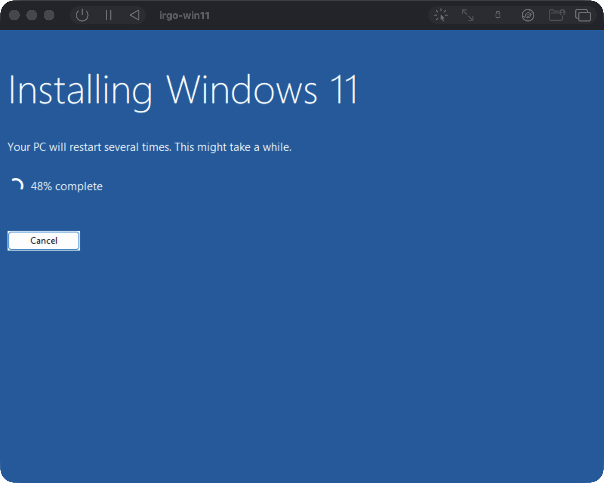
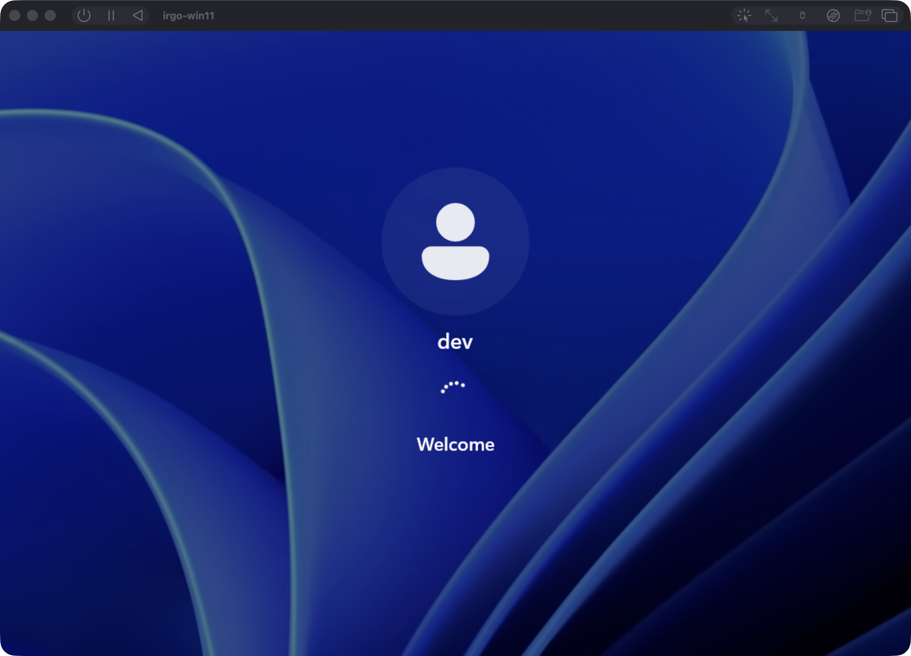

# irgo-windows-vm

<https://github.com/joeblew999/irgo-windows-vm>

[Docs site](https://joeblew999.github.io/irgo-windows-vm/)

Build a Go desktop program on your Mac, and find out whether it really works on Windows.

One command, `irgo-winvm`, makes a real Windows 11 ARM64 virtual machine on
Apple Silicon, runs your program inside it, and brings back what happened. No
GUI to drive, no manual install, nothing to click. `irgo-winvm mcp` offers the
same commands to an AI agent, so an agent writing a desktop app on a Mac can
ask real Windows too.

## What it is for

This is the VM system for **[Irgo](https://github.com/stukennedy/irgo)**, a
framework for building apps in Go with Datastar that run on iOS, Android,
**desktop** and the web.

An app that runs on one desktop is not a desktop app. Irgo's desktop half rests
on [glaze](https://github.com/crgimenes/glaze) (the webview) and
[native](https://github.com/crgimenes/native) (the OS integration around it),
and *"it works on my Mac"* says nothing about Windows, which cannot be checked
by reading the code. So this installs a real Windows, runs the program there,
and reads back what it actually did, to find what breaks in glaze and native on
Windows.

Once that is dependable it belongs inside Irgo, so that checking a desktop build
on every platform is part of building one.

## Get it

Download the [latest release](https://github.com/joeblew999/irgo-windows-vm/releases/latest)
for your Mac (`arm64` for Apple Silicon), then:

```sh
chmod +x irgo-winvm-darwin-arm64
xattr -d com.apple.quarantine irgo-winvm-darwin-arm64
./irgo-winvm-darwin-arm64
```

The second line is needed because macOS refuses anything downloaded from the
internet; without it Gatekeeper reports the binary as damaged. It needs macOS
on Apple Silicon, and installs UTM itself if you do not have it.
[All releases](https://github.com/joeblew999/irgo-windows-vm/releases) are
listed with checksums.

## Try it

Three commands, in this order. Each is safe to repeat: if it is already done,
it says so and stops.

```sh
irgo-winvm iso-create -fetch    # get the Windows installer
irgo-winvm vm-create -install   # make a VM and install Windows on it, unattended
irgo-winvm app-create your.exe  # run your program in that VM, output back
```

The first two are slow, once: a large download, then an install you do not have
to watch ([what each costs](docs/DEVELOPMENT.md#what-it-costs)). After that,
running a program takes seconds.

`irgo-winvm doctor` tells you what is set up and what is missing.

## What it looks like

Taken by the tool itself, not mock-ups. Windows installing with nobody at the
keyboard:



And ready for your program:



## Does glaze work?

`mise run glaze:mac` and `mise run glaze:windows` answer that with one YES or
NO. When the answer is NO, the fix goes to
[crgimenes/glaze](https://github.com/crgimenes/glaze) or
[crgimenes/native](https://github.com/crgimenes/native), never into a workaround
here: finding those bugs is the point, and a workaround hides a bug that still
ships to everyone using those libraries.

## More

- **[CONTRIBUTING](docs/CONTRIBUTING.md)**: how to set up, what to run, how to
  land a change, how to check glaze.
- **[DEVELOPMENT](docs/DEVELOPMENT.md)**: how it works, the commands, exit
  codes and costs, and every trap that cost hours.
- **[RESULTS](docs/RESULTS.md)**: what has been measured, dated, with
  screenshots.
- **[UPSTREAM](docs/UPSTREAM.md)**: what was found in glaze, native and UTM, and
  where it was fixed.
- **[ROADMAP](docs/ROADMAP.md)**: what is next.
- **[THREAT-MODEL](docs/THREAT-MODEL.md)**: what serving it over HTTP exposes.
- **[Command reference](https://joeblew999.github.io/irgo-windows-vm/reference.html)**:
  every command and flag, captured from the binary.

MIT licensed. See [LICENSE](LICENSE).
