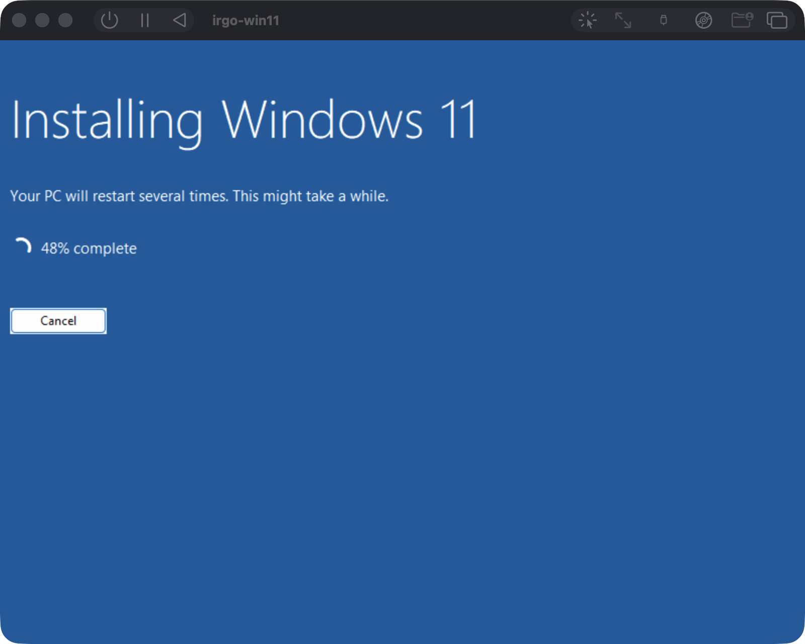

# Probe results

## A self-built ISO installs Windows — verified 12 Aug 2026



That is UTM, booted from an ISO mastered by `irgo-winvm iso-create`, installing
unattended. It settles every open question about replacing CrystalFetch:

| question | answer |
|---|---|
| can macOS master bootable Windows ARM64 media? | **yes**, with `xorriso` |
| does `hdiutil` work? | **no.** Two images, one hiding everything from ISO9660 and one hiding nothing, both enumerate as `FS0: /CDROM(0x0)` and both refuse to boot |
| is UDF required for the 4.099 GiB `install.wim`? | **no.** ISO9660 level 3 multi-extent is enough — Setup read it and installed |
| so is `cdrtools` needed? | **no.** `xorriso` alone. One Homebrew formula |
| does `efisys_noprompt.bin` skip "Press any key to boot from CD"? | **yes** — it went straight into Setup |

The last row matters beyond convenience. Booting currently depends on typing
`\efi\boot\bootaa64.efi` at the UEFI shell and firing eight keypresses over six
seconds — a hack this README documents as costing hours and as having once
destroyed an install when surplus presses reached Setup's UI. Media built with
the no-prompt loader does not need it.

Full detail, including the two failed attempts and why they failed, is in
the trap table in [README.md](README.md).

---

The point of this repo is parity: the same probes, the same glaze version, on
both platforms. A pass on one OS proves nothing on its own. Probes are built
from `probe/` (native capabilities) and `glaze-probes/` (glaze's `app://` scheme
and its Events bridge).

## Suspend and resume — 400 ms, verified 12 Aug 2026

Three consecutive cycles on Windows 11 ARM64, each measured to a live guest
agent, with the guest's own boot time as the fingerprint:

```
baseline  System Boot Time: 8/12/2026, 10:33:36 AM
cycle 1   resumed in 400ms   boot time unchanged -> STATE PRESERVED
cycle 2   resumed in 400ms   boot time unchanged -> STATE PRESERVED
cycle 3   resumed in 400ms   boot time unchanged -> STATE PRESERVED
```

The boot time is the proof rather than the speed: it changes on a reboot and
not on a resume, so an unchanged value means the guest genuinely continued
rather than quietly restarting. A cold boot for comparison was **59 seconds**,
and additionally has to be driven through the UEFI shell with eight keypresses —
which needs an unlocked Mac and a visible display window.

`irgo-winvm vm-create` resumes a suspended VM rather than rebooting it, so the
idempotent path is the fast one.

**The state is in memory** and does not survive quitting UTM. The durable
version is not offered; `utmctl suspend --save-state` either refuses (naming GPU
acceleration, then NVMe) or *reports success and power-cuts the guest* — exit 0,
no state file, next boot through "Diagnosing your PC". See the trap table in
[README.md](README.md).

## macOS — verified

Host: Apple M2 Pro, macOS 26.5, `glaze v0.0.47`, `CGO_ENABLED=0`.

### Native capabilities

| capability | result |
|---|---|
| `clipboard.write` / `clipboard.read` | OK — round trip verified, original clipboard restored |
| `power.preventSleep` | OK — acquired and released |
| `singleinstance.acquire` | OK — lock held, re-acquire correctly refused |
| `mmap.map` | OK — mapped and wrote through |
| `openurl` / `tray` / `filedialog` / `menu` / `nocapture` / app icon | covered by `examples/glaze-all` — see the windows/arm64 table below, which lists both platforms |
| `notifications`, `keychain`, `fswatch` | **missing from the ecosystem** (`native/notify` is planned, not built) |

### glaze `app://` scheme

```
origin:        app://home
secureContext: true
cryptoSubtle:  true
localStorage:  true
pushState:     /deep/link/route
css:           32px
```

`pushState` succeeding is the load-bearing result: it means client-side routing
works. The same probe over `file://` fails with `SecurityError`, which is why
the `app://` scheme handler matters and `file://` is not a substitute.

`css: 32px` is `getComputedStyle` returning the stylesheet's `2rem`, proving the
asset was fetched through the Go handler *and* applied by the engine — not
merely served.

### glaze Events bridge

```
PASS: JS -> Go   : "js-listener-installed"
PASS: Go -> JS   : 3 unsolicited pushes delivered
PASS: round trip : received=["tick:1","tick:2","tick:3"] domChildren=3
sockets during run: NONE
```

`domChildren=3` shows server-initiated pushes actually mutated the DOM. With
zero sockets, this is a genuine SSE substitute for a desktop app — relevant
because glaze's `SchemeResponse` is a buffered `[]byte` on the UI thread and so
cannot stream SSE itself.

## Windows ARM64 — MEASURED (native capabilities), 12 Aug 2026

Host: Apple M2 Pro / UTM 4.7.5, guest Windows 11 ARM64 build 26100, run headless
through the QEMU guest agent — no GUI, no keystrokes, no screen.

### The inner loop works

```
$ irgo-winvm app-create -vm irgo-win11 hello-arm64.exe alpha beta
hello from windows/arm64
args: [alpha beta]
```

10.8 seconds end to end. The binary was cross-compiled on macOS with plain
`GOOS=windows GOARCH=arm64` and **no toolchain at all** — which is what cgo-free
buys, and what irgo cannot currently do because mingw pins it to amd64.

A failing guest binary fails the command. The host does **not** exit with the
guest's code — a binary exiting 3 exits `app-create` **1**, with "exited 3 in
the guest" in the message. The two must not look alike, because a missing VM
exits 3 and a busy guest agent exits 4; see the contract in
[README.md](README.md).

### Native capabilities — windows/arm64, native

| capability | result |
|---|---|
| `clipboard.write` / `clipboard.read` | **OK** — round trip verified |
| `power.preventSleep` | **OK** — acquired and released |
| `singleinstance.acquire` | **OK** — lock held, re-acquire correctly refused |
| `mmap.map` | **OK** — mapped and wrote through |
| `notifications`, `keychain`, `fswatch` | missing from the ecosystem |

Identical to the macOS column. Every capability that works on macOS works on
Windows ARM64.

### The windowed half — `examples/glaze-all`, windows/arm64, `-gui`

The rows that used to say *skipped* here. Run in the VM with
`irgo-winvm app-create -vm irgo-win11 .bin/glaze-all-arm64.exe`, exit code 0:

| capability | windows/arm64 | darwin/arm64 |
|---|---|---|
| `openurl.Open` (`file://`) | **OK** | **OK** |
| `openurl.Open` refusing a custom scheme | **OK** | **OK** |
| `openurl.Reveal` | **OK** | **OK** |
| `menu.Set` (native menu bar) | **OK** | **OK** |
| `tray.Run` (icon raised and removed) | **OK** | **OK** |
| `glaze.OpenFile` (native file dialog) | **OK** | **OK** |
| `nocapture.Protect` | **OK** | UNSUPPORTED — by design |
| `glaze.SetAppIcon` | UNSUPPORTED — by design | **OK** |

The last two rows are the interesting ones, and they are mirror images: each
platform is missing exactly what the other has. `nocapture` on macOS is right
to refuse — Apple removed the API — and Windows takes its app icon from the
executable's resources, decided before the process starts. Neither is a
failure, and getting the report to *say* so needed a fix in glaze and native
themselves ([UPSTREAM.md](UPSTREAM.md) §2): every package defined its own
`ErrUnsupported` without wrapping the standard one, so both rows read FAILED
and a wholly correct run exited non-zero.

This is the first time the whole native surface has been run together on
Windows — not in this repo, not in glaze's examples, and not in
`crgimenes/native`, all of which test one capability per binary.

### glaze probes — MEASURED, 12 Aug 2026

Both ran on Windows 11 ARM64 via `irgo-winvm app-create -gui`. This closes the
project's stated goal: everything glaze does is now measured on both platforms.

**Events bridge — fully working.**

```
PASS: JS -> Go   : "js-listener-installed"
PASS: Go -> JS   : 3 unsolicited pushes delivered
PASS: round trip : received=["tick:1","tick:2","tick:3"] domChildren=3
```

**`app://` scheme — works, with one serious caveat that is an upstream bug.**

```
origin:        https://app.localhost      (macOS reports app://home)
secureContext: true
relative sub-resources:  served
absolute app:// sub-resources:  NEVER REQUESTED
```

The scheme handler works and the origin is secure, but **absolute `app://` URLs
inside a page do not load on Windows** — silently, with no error. glaze emulates
the scheme there with a virtual host, so the document loads from
`https://app.localhost/` and an absolute `app://home/app.js` names a scheme
WebView2 does not know.

A glaze app that works on macOS therefore loses every stylesheet and script on
Windows, with nothing to say why. Written up in
[UPSTREAM.md](UPSTREAM.md) §1b, with the fix (WebView2's real custom-scheme
registration). **Reference assets relatively and both platforms work** — which
is what `verifyevents` now does, and why it passes.

This is exactly the class of bug the project was built to find: invisible from a
Mac, invisible in glaze's own CI (`windows-latest` is x64 and has no ARM64
desktop), and silent when it happens.

### Two constraints learned getting there

Both were guessed at first, then understood:

- **The guest agent runs without a desktop session.** A GUI app started through
  it has no window station, so the glaze probes need launching into the
  interactive session — a scheduled task with `/it`, not a plain exec.
- **Keystrokes do not reach the VM while the Mac is locked.** Boot recovery
  depends on typing at the UEFI shell, so a locked screen blocks it. This is the
  strongest argument for suspend/resume: resuming restores RAM and never reaches
  the firmware, so it needs no keystrokes and works locked.

## The unattended install — verified 11 Aug 2026

Windows 11 ARM64 (build 26100) reached a logged-in desktop as `dev` with no
interaction after the boot command. That proves the answer file, the disk
layout, the display device and the boot path:

| claim | status |
|---|---|
| ARM64 Windows installs unattended in UTM | **yes** — desktop reached, auto-login as `dev` |
| answer file is read and applied | **yes** — GPT layout matched `DiskConfiguration` exactly |
| `virtio-ramfb-gl` display works | **yes** — Setup and desktop both render |
| NVMe system disk is visible to Setup | **yes** |
| glaze runs on Windows | **yes** — measured 12 Aug, above |

## Still to measure: x64 under emulation

One claim from the original list is genuinely unanswered. Every Windows result
in this file is ARM64-native; nothing here has been run as an amd64 build under
emulation.

- **x64-under-emulation behaviour.** Whether an amd64 build behaves identically
  on ARM Windows decides whether Mac-local testing has any fidelity at all, or
  whether x64 testing must live on x86 hardware.

The tooling for it exists — `probe/run-probe.cmd` runs the ARM64-native and the
x64-emulated build in turn — so what is missing is the run and the record of it,
not the means. Last evidence gathered 13 Aug 2026, all of it ARM64.

One further item is **exercised but not recorded**. glaze's hand-written ARM64
ABI code (`putbounds_arm64.go`, a 16-byte RECT passed in two registers per
AAPCS64 rather than by hidden reference as on amd64) is necessarily executed by
every `-gui` run above, since a window cannot be positioned without it. No run
has been made that reports on it specifically, so this file does not claim one
way or the other.


## Still open

Everything the plan files tracked is done and measured above. What is left:

- **Durable suspend.** Resume is 400 ms but the state is in memory, so it does
  not survive quitting UTM. The blocker is the emulated NVMe device, and NVMe is
  not optional — Windows ARM64 Setup has no inbox VirtIO storage driver. Getting
  past it means switching the system disk to VirtIO and injecting the driver
  into `boot.wim`, which is now reachable because `iso-create` already drives
  wimlib over the media.
- **`Delete` safety.** It removes files 30 seconds after asking QEMU to stop,
  whether or not it actually did. (`Prune` was the worse half of this and is
  fixed: it used to delete any `*.img`/`*.dmg` in the system temp directory
  regardless of owner.)
- **Dead code.** `BuildFATImage`, `OpenDisplay`, `BootAssist`,
  `SchemaConfigurationVersion`, `IfaceVirtIO` and `GuestToolsInstallCommand` are
  unreferenced; the last still carries a `start`-wildcard bug already fixed in
  the answer file.
- **Nothing found upstream has been reported upstream.** Patches for two of
  them exist only as uncommitted edits in local clones. The status of every
  finding is the table at the top of [UPSTREAM.md](UPSTREAM.md) — a count kept
  here would be a second copy, and this one was already wrong.

**No irgo integration until this works standalone with glaze.** Integrating a
tool that does not yet work makes the framework absorb its failures.

## The ISO scan verdict is recorded at build time — 13 Aug 2026

Checking "is this media ARM64" reads the whole file. On a 4.9 GB ISO that is
**77 seconds**, and it happened on every `iso-create`, printing nothing while
it ran.

The verdict is now cached beside the ISO, keyed by size and mtime, and written
by the build itself — which knows the answer, having just mastered the ISO from
an ARM64 `.esd`.

| | |
|---|---|
| first check of a fresh ISO, before | 77.2 s |
| same check, after | **0.0 s** |
| rebuild from a kept `.esd`, no network | 39.5 s |
| full fetch + expand + master from nothing | 250 s |

The rebuild figure is why `iso-delete` keeps the `.esd` by default: the ISO
costs 39 seconds of local work to recreate, the `.esd` costs 4.2 GB from a
source that rate-limits.

Not covered by a test: that the build still records the verdict. That path
needs a real `.esd`, so deleting the call leaves the unit tests green. This
measurement is the check.
