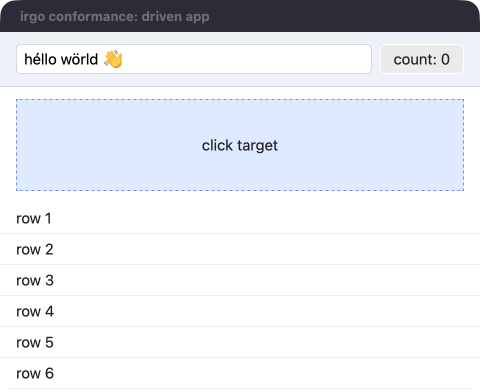
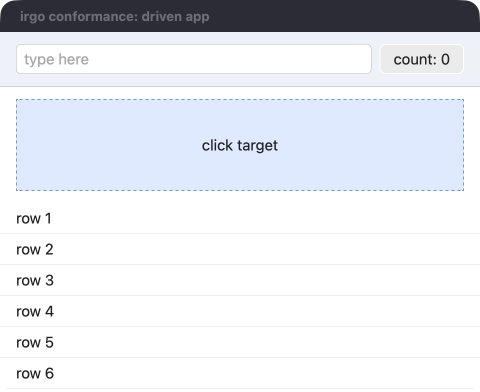
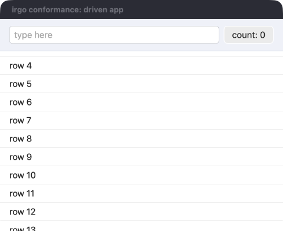
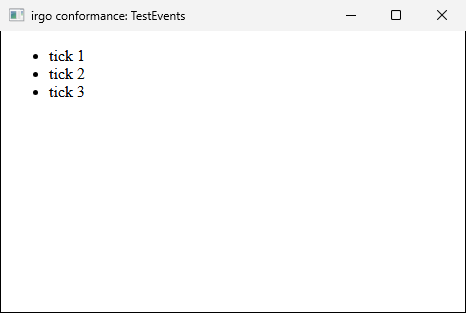
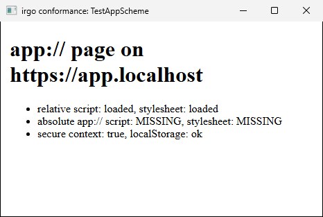
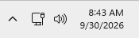
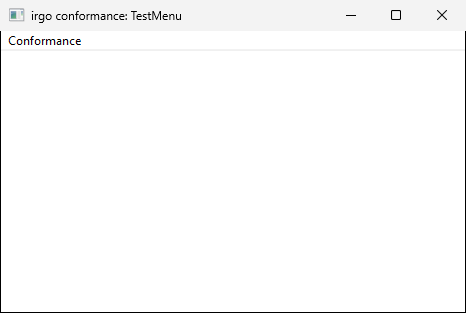
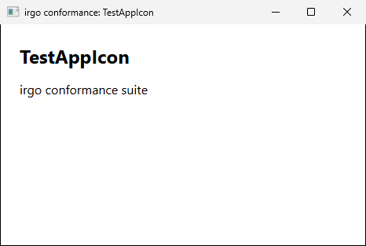
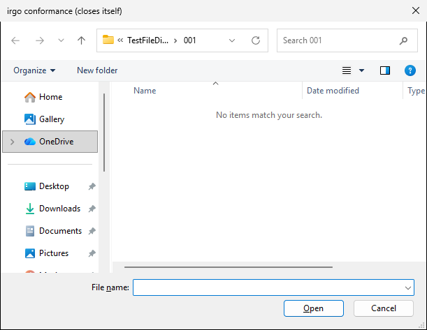

# Glaze status

Does glaze work on the Mac and on Windows? The last recorded answer for each,
written by `irgo-winvm glaze-check` (`mise run glaze:mac` and
`mise run glaze:windows`) and read back by `irgo-winvm glaze-status`,
which also says whether it still describes the tree. Generated: do not edit it by
hand. Each run replaces only its own section. Every row is one test of
`examples/conformance`, from its test2json events; what each checks is in its
comment, and how the suite runs is in [CONTRIBUTING.md](CONTRIBUTING.md#does-glaze-work).

<!-- glaze-status:mac commit=55a25b05f1a6d79775f5a5a2adf90378d7b28a68 examples-dirty=true glaze=v0.0.61 native=github.com/joeblew999/native@v0.1.16-0.20261001015633-2fbbf2d09e65 -->
## On the Mac — YES: 40 passed, 1 skipped

- when: 2026-10-01 09:08 +0700, took 20s
- platform: darwin/arm64 (this machine, natively)
- this repository: commit `55a25b05f1a6`, **with uncommitted changes**
- glaze v0.0.61 (released)
- native from the fork github.com/joeblew999/native@v0.1.16-0.20261001015633-2fbbf2d09e65 (go.mod requires v0.1.15 and replaces it)
- full log: `~/Library/Application Support/irgo-winvm/logs/glaze-mac-20261001-090850.log`
- test2json events: `~/Library/Application Support/irgo-winvm/logs/glaze-mac-20261001-090850.json`
- screenshots: 14 of the 14 tests that open a window took one — see [Screenshots](#screenshots)

| test | result | first message |
|---|---|---|
| TestDriveType | PASS |  |
| TestDriveType/before | PASS |  |
| TestDriveType/after | PASS |  |
| TestDriveClick | PASS |  |
| TestDriveClick/before | PASS |  |
| TestDriveClick/after | PASS |  |
| TestDriveClick/script_click_is_untrusted | PASS |  |
| TestDriveClickAt | PASS |  |
| TestDriveClickAt/clicked | PASS |  |
| TestDriveScroll | PASS |  |
| TestDriveScroll/before | PASS |  |
| TestDriveScroll/after | PASS |  |
| TestEvents | PASS |  |
| TestEvents/js_to_go | PASS |  |
| TestEvents/go_to_js_unsolicited | PASS |  |
| TestClipboard | PASS |  |
| TestPowerPreventSleep | PASS |  |
| TestSingleInstance | PASS |  |
| TestSingleInstance/second_acquire_refused | PASS |  |
| TestSingleInstance/send_reaches_holder | PASS |  |
| TestSingleInstance/release_frees_it | PASS |  |
| TestMmap | PASS |  |
| TestAppScheme | PASS |  |
| TestAppScheme/js_calls_go | PASS |  |
| TestAppScheme/relative_subresources | PASS |  |
| TestAppScheme/absolute_subresources | PASS |  |
| TestAppScheme/origin_capabilities | PASS |  |
| TestOpenURL | PASS |  |
| TestOpenURL/refuses_custom_protocol | PASS |  |
| TestOpenURL/refuses_javascript | PASS |  |
| TestOpenURL/refuses_app_scheme | PASS |  |
| TestOpenURL/refuses_no_scheme | PASS |  |
| TestOpenURL/refuses_empty | PASS |  |
| TestOpenURL/reveal_refuses_missing_path | PASS |  |
| TestTray | PASS |  |
| TestTray/running | PASS |  |
| TestTray/stop_removes_it | PASS |  |
| TestMenu | PASS |  |
| TestNoCapture | skip | `windowed_test.go:190: nocapture is unsupported on darwin by design: nocapture: not supported on this platform` |
| TestAppIcon | PASS |  |
| TestFileDialog | PASS |  |
<!-- /glaze-status:mac -->

<!-- glaze-status:windows commit=f16189091b5ee7d1eadc6e5f1668686233bbf95f examples-dirty=false glaze=v0.0.61 native=v0.1.15 -->
## On Windows — KNOWN BUGS ONLY: TestAppScheme/absolute_subresources (docs/UPSTREAM.md §1b) fail, known upstream bugs listed in docs/UPSTREAM.md; nothing else did

- when: 2026-09-30 15:43 +0700, took 30s
- platform: windows/arm64, VM irgo-win11 (through app-create -gui)
- this repository: commit `f16189091b5e`
- glaze v0.0.61 (released)
- native v0.1.15 (released)
- full log: `~/Library/Application Support/irgo-winvm/logs/glaze-windows-20260930-154316.log`
- test2json events: `~/Library/Application Support/irgo-winvm/logs/glaze-windows-20260930-154316.json`
- screenshots: 7 of the 7 tests that open a window took one — see [Screenshots](#screenshots)

| test | result | first message |
|---|---|---|
| TestEvents | PASS |  |
| TestEvents/js_to_go | PASS |  |
| TestEvents/go_to_js_unsolicited | PASS |  |
| TestClipboard | PASS |  |
| TestPowerPreventSleep | PASS |  |
| TestSingleInstance | PASS |  |
| TestSingleInstance/second_acquire_refused | PASS |  |
| TestSingleInstance/send_reaches_holder | PASS |  |
| TestSingleInstance/release_frees_it | PASS |  |
| TestMmap | PASS |  |
| TestAppScheme | fail (a subtest failed) |  |
| TestAppScheme/js_calls_go | PASS |  |
| TestAppScheme/relative_subresources | PASS |  |
| TestAppScheme/absolute_subresources | **FAIL** — known upstream: docs/UPSTREAM.md §1b | `scheme_test.go:206: app://home/abs.js did not run; the scheme handler was asked for it: false. The document's origin is https://app.localhost — on Windows this is glaze bug docs/UPSTREAM.md §1b: the scheme is emulated with a virtual host, so an absolute app:// URL inside the page names a scheme WebView2 does not know` |
| TestAppScheme/origin_capabilities | PASS |  |
| TestOpenURL | PASS |  |
| TestOpenURL/refuses_custom_protocol | PASS |  |
| TestOpenURL/refuses_javascript | PASS |  |
| TestOpenURL/refuses_app_scheme | PASS |  |
| TestOpenURL/refuses_no_scheme | PASS |  |
| TestOpenURL/refuses_empty | PASS |  |
| TestOpenURL/reveal_refuses_missing_path | PASS |  |
| TestTray | PASS |  |
| TestTray/running | PASS |  |
| TestTray/stop_removes_it | PASS |  |
| TestMenu | PASS |  |
| TestNoCapture | PASS |  |
| TestAppIcon | skip | `windowed_test.go:201: appicon is unsupported on windows by design: glaze: setting the application icon at runtime is not supported on this platform` |
| TestFileDialog | PASS |  |
<!-- /glaze-status:windows -->

## Screenshots

Every test that opens a window photographs it at the moment that shows what it checked — the page loaded, the tray up, the menu installed, the dialog open — and the picture is recorded with the run it came from. A capture that failed says why instead of showing a picture; a black or one-colour frame counts as failed. How each is taken is in `examples/conformance/shots_test.go`.

- Mac: 2026-10-01 09:08 +0700, commit `55a25b05f1a6`, darwin/arm64 (this machine, natively)
- Windows: 2026-09-30 15:43 +0700, commit `f16189091b5e`, windows/arm64, VM irgo-win11 (through app-create -gui)

| test | Mac | Windows |
|---|---|---|
| TestDriveType/before | PASS  | no picture in this run: the test skipped or failed first, or was not in it |
| TestDriveType/after | PASS  | no picture in this run: the test skipped or failed first, or was not in it |
| TestDriveClick/before | PASS  | no picture in this run: the test skipped or failed first, or was not in it |
| TestDriveClick/after | PASS  | no picture in this run: the test skipped or failed first, or was not in it |
| TestDriveClickAt/clicked | PASS  | no picture in this run: the test skipped or failed first, or was not in it |
| TestDriveScroll/before | PASS  | no picture in this run: the test skipped or failed first, or was not in it |
| TestDriveScroll/after | PASS  | no picture in this run: the test skipped or failed first, or was not in it |
| TestEvents | PASS  | PASS  |
| TestAppScheme | PASS  | fail (a subtest failed)  |
| TestTray/running | PASS  the window the tray was started beside; the status item is drawn outside this process and its window could not be captured: screencapture -o -l 4294967296: exit status 1: could not create image from window | PASS  |
| TestMenu | PASS  the window the menu was installed for; macOS draws the menu bar outside this process, and a capture of that part of the screen shows the desktop behind it, not the menus | PASS  |
| TestNoCapture | skip  | PASS  black: the window is excluded from capture, which is what Protect is for |
| TestAppIcon | PASS  | skip  |
| TestFileDialog | PASS  | PASS  |
