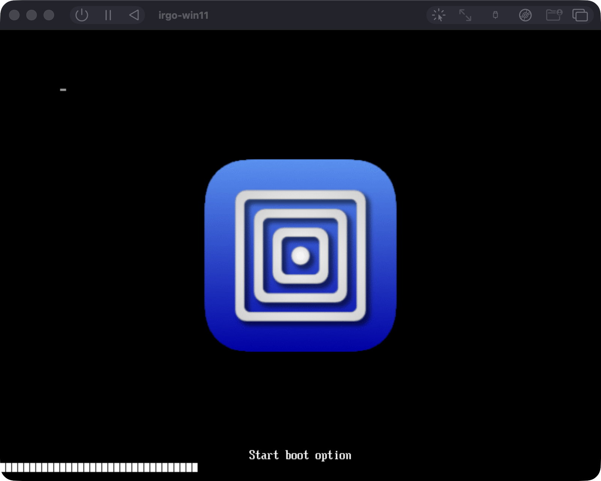
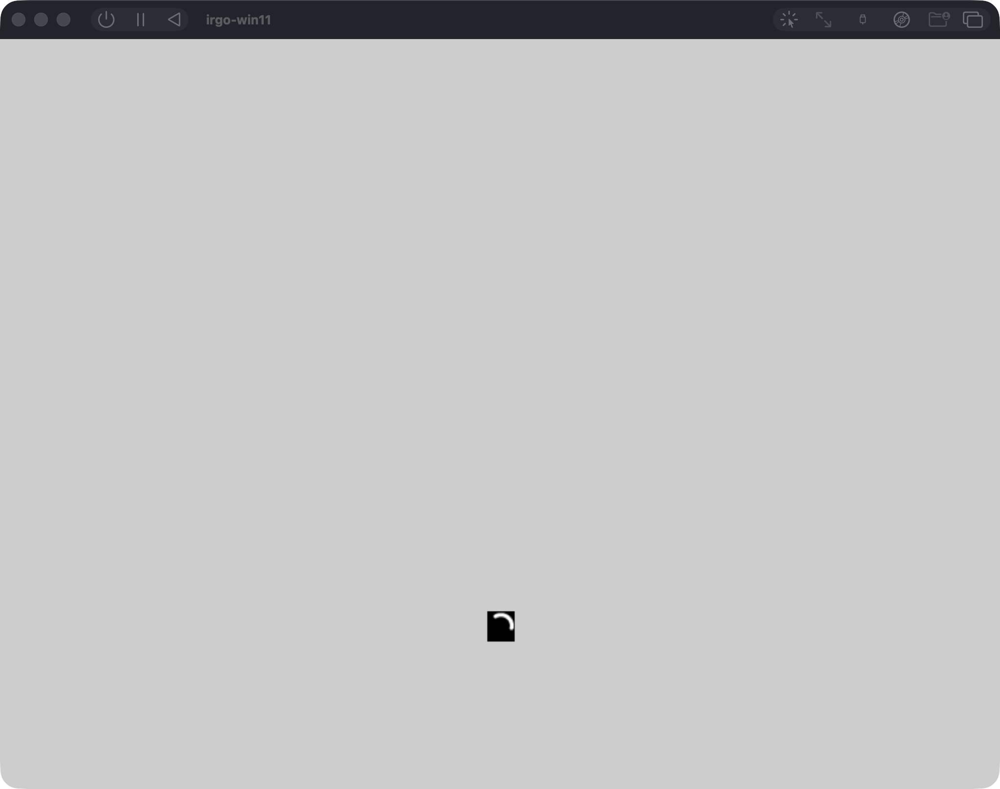
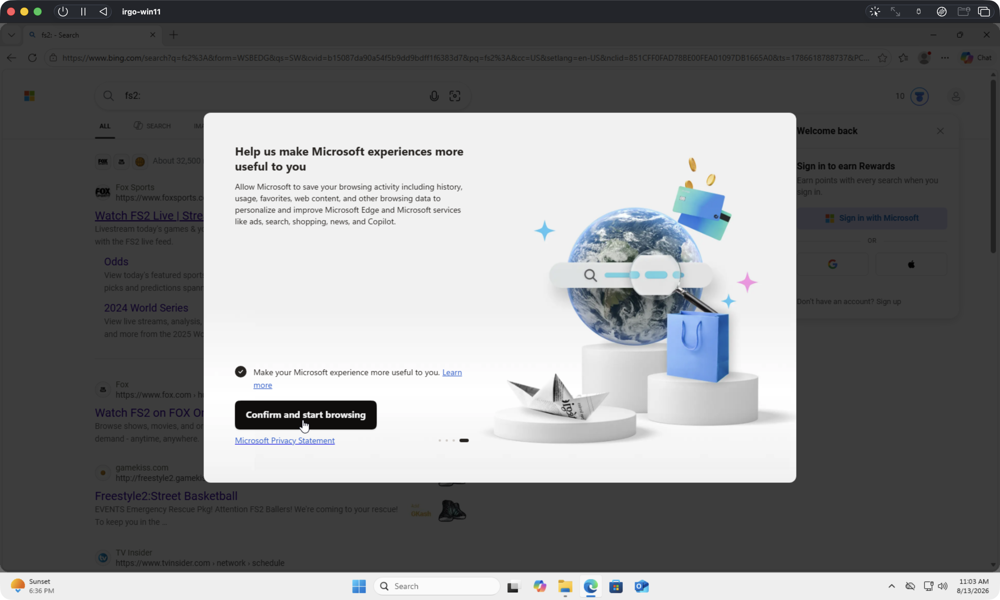

# Results

What has been measured, newest first. Each entry keeps the date it was measured
and the numbers it found. If a later run changes a number, correct it here too.

The goal is parity: the same probes, against the same glaze version, on both
platforms. A pass on one OS proves nothing on its own. Entries up to 30 Sep
2026 name the probes they ran: `examples/probe/` (native capabilities), and
`examples/verify` and `examples/verify-events` (glaze's `app://` scheme and its
Events bridge). Since then the same checks are the test suite
`examples/conformance`, and [GLAZE-STATUS.md](GLAZE-STATUS.md) holds its latest
run per platform.

## At a glance

| date | result |
|---|---|
| 1 Oct 2026 | [several callers on one Mac: an agent refused the owner's VM, a second clone refused for memory, a busy clone kept and an idle one reaped](#several-callers-on-one-mac--measured-1-oct-2026) |
| 1 Oct 2026 | [the drive tests on GitHub's Windows ARM64 runner: what took the foreground, and three green runs in a row](#the-drive-tests-on-githubs-windows-arm64-runner--measured-1-oct-2026) |
| 1 Oct 2026 | [the real golden image through the private R2 cache: 8.4 GB, pulled byte-identical in 4 min 37 s](#the-real-golden-image-through-the-private-r2-cache--measured-1-oct-2026) |
| 1 Oct 2026 | [a VM of your own in 23 s: install 12 min 24 s once, seal 2 min 49 s, then `vm-create` clones and boots](#a-vm-of-your-own-in-23-s--measured-1-oct-2026) |
| 1 Oct 2026 | [a glaze app driven by real OS input in the background: type, click, click-at, scroll, all `isTrusted`, frontmost app unchanged](#a-glaze-app-driven-by-real-os-input--measured-1-oct-2026) |
| 30 Sep 2026 | [pushes go over SMB: 49 MB in 1.6 s instead of 1 min 17 s; `glaze:windows` 31 s → 24 s](#pushes-go-over-smb--measured-30-sep-2026) |
| 30 Sep 2026 | [GoReleaser rebuilds v0.4.1 byte for byte](#goreleaser-reproduces-the-published-v041-byte-for-byte--verified-30-sep-2026) |
| 16 Aug 2026 | [an agent uploaded and ran a binary over HTTP](#an-agent-uploaded-pushed-and-ran-a-binary-over-http--verified-16-aug-2026) |
| 14 Aug 2026 | [an agent drove every step over MCP](#an-agent-drove-the-whole-thing-over-mcp--verified-14-aug-2026) |
| 13 Aug 2026 | [the ISO architecture check went from 77.2 s to 0.0 s](#the-iso-scan-verdict-is-recorded-at-build-time--13-aug-2026) |
| 12 Aug 2026 | [an ISO this repo built installs Windows](#a-self-built-iso-installs-windows--verified-12-aug-2026) |
| 12 Aug 2026 | [suspend and resume takes 400 ms](#suspend-and-resume--400-ms-verified-12-aug-2026) |
| 12 Aug 2026 | [glaze and native work on Windows ARM64](#glaze-and-native-on-windows-arm64--measured-12-aug-2026), with one upstream bug |
| 11 Aug 2026 | [Windows installs unattended](#the-unattended-install--verified-11-aug-2026) |
| — | [the macOS baseline](#macos--verified) |
| not yet | [x64 under emulation](#still-to-measure-x64-under-emulation) |

## Several callers on one Mac — measured 1 Oct 2026

**Result:** the guards in [Sharing one Mac](DEVELOPMENT.md#sharing-one-mac)
behave on the real machine. M2 Pro, 16 GiB, UTM 4.7.5, with `irgo-win11`
running throughout and never touched; one disposable clone, `z1`.

| step | command | measured |
|---|---|---|
| what a running VM holds | `footprint` on its QEMULauncher, `sysctl vm.swapusage` | `irgo-win11` (8192 MiB configured): **8327 MB footprint, 8051 MB dirty**; swap 6.3 of 7 GB in use |
| UTM's memory per VM | AppleScript `memory of configuration` | 8192 for both VMs, in 0.6 s, no Full Disk Access |
| a clone while `irgo-win11` runs | `vm-create -vm z1` | **exit 7** in 0.7 s: 16 GiB, 8 running, 8 for z1, 0 left, want 4; nothing made, no record |
| the same, deliberately | `vm-create -vm z1 -overcommit` | made and answering in **26 s**; disk read through `statfs` on UTM's volume: 41.9 GiB free, want 20 |
| a second clone | `vm-create -vm z2` (another owner) | **exit 7**, naming `irgo-win11` and `z1` as the 16 GiB already running |
| an agent without `-vm` | `IRGO_WINVM_OWNER=… app-create x.exe` | **exit 2**, told to `vm-create -vm <name>` |
| an MCP client without `-vm` | stdio, client `agent-x`, `app-create` | `code 2, status usage`, the caller named as `agent-x/apple@…:repo-b (from MCP client)` |
| staging | `app-upload` from clients `agent-y` and `agent-x`, then `app-delete` from `agent-x` | each staged under its own `bin/agent-…-<hash>/`; agent-x's delete left agent-y's file |
| a run on the clone | `app-create -vm z1 zhello.exe` | output back in 4.1 s (SMB, 1.9 s); the record's last use moved |
| reaping, in lease | `vm-reap -stale 1h` | `keep z1 — in lease`, exit 0 |
| reaping, while `vm-repair -vm z1` ran | `vm-reap -stale 1s -force` | `keep z1 — in use: a command holds its lock`; nothing deleted |
| reaping, idle | `vm-reap -stale 1s -force` | `z1` stopped and deleted through UTM in 4.9 s, record removed; `irgo-win11` and `irgo-golden` untouched |
| a left-over record | a record for a VM UTM does not have, and one for `irgo-win11` | `forget` and `keep — protected`; `-force` removed only the first |

Not measured: how much a clone grows over a working day. `df` fell by about
1.1 GiB across z1's clone, boot, one run and a `vm-repair`, with the rest of the
Mac writing too, so `cloneHeadroomBytes` stays an estimate.

## The drive tests on GitHub's Windows ARM64 runner — measured 1 Oct 2026

**Result:** `TestDriveType`, `TestDriveClick`, `TestDriveClickAt` and
`TestDriveScroll` pass on the `windows-11-arm` job three runs in a row, with no
retry, no foreground change and every OS step `isTrusted`:
[36810013494](https://github.com/joeblew999/irgo-windows-vm/actions/runs/36810013494),
[36810234766](https://github.com/joeblew999/irgo-windows-vm/actions/runs/36810234766),
[36810464096](https://github.com/joeblew999/irgo-windows-vm/actions/runs/36810464096)
(branch `drive-windows-reliable`; macOS green in each). Image
`windows-11-vs2026-arm64`, native at fork PR #2 (`2fbbf2d`), glaze v0.0.61.

Before: run 36804946289 failed `TestDriveClick` ("no matching event (9 so
far)", then "the frontmost app was window 0x40270 (pid 6808) before this test
and window 0x30284 (pid 11052) after it, which this test does not own"). Two
causes, each found by tracing the foreground at every step:

| cause | how it showed | fix |
|---|---|---|
| glaze created the app's window, and on Windows glaze's window activates itself | with the old window and the new trace (branch `drive-windows-diag`, run 36808088081) every drive test failed the same way: the app's window was the foreground window from "window up", +0.5 s, to the close. Closing it handed the foreground to some other window, which is why the old check blamed a stranger. The `TestDriveClick` screenshot of run 36804946289 shows its title bar drawn active | `drive` makes the window itself with `WS_EX_NOACTIVATE` and `SW_SHOWNOACTIVATE`, as native's testwin does; the tests now fail if the app's window is ever in front |
| WSL's updater, relaunched for the whole job | `WindowsTerminal.exe "C:\Windows\system32\wsl.exe"` became the foreground in the middle of `TestDriveScroll` (run 36808085142). A process-start trace (run 36809190167) showed `provjobd.exe`, a child of the runner's `hosted-compute-agent`, running `wsl.exe` every 30 s; WSL is not installed, so the inbox stub starts `wsl.exe --update --confirm --prompt-before-exit` in a new Windows Terminal window whenever none is running, and that waits about 60 s. Stopping it brought it back within 30 s; `wsl --update` exits 1 ("not installed") | `runner-desktop.ps1` makes `wsl.exe` run `cmd /c exit 1` (Image File Execution Options) for the job; the trace then showed `provjobd` starting `cmd.exe` every 30 s and no window (run 36809643314). Upstream: [actions/runner-images#14264](https://github.com/actions/runner-images/issues/14264) |

Also on that desktop at job start, every run: the full-screen "Microsoft
account" prompt (`WWAHost.exe`), Start and Search open under it (on one runner
both reopened 3 s after their hosts were stopped, so they are now closed until
they stay closed), a "System Properties" dialog, Widgets, and OneDrive's
first-run setup starting OneDrive a minute in. The keyboard retries in
`TestDriveType` never fired in these runs: with focus moved into the page on
load, the field took focus on the first click every time.

## The real golden image through the private R2 cache — measured 1 Oct 2026

**Result:** the sealed golden image (Windows 11 Pro 26100.4349) went up to the
private bucket `irgo-golden` through the Worker and came back **byte-identical**:
SHA-256 of `Data/disk.img`, `efi_vars.fd`, `tpmdata` and `config.plist` equal to
the UTM export. A machine without a golden image gets one in under 5 minutes
instead of a 12-minute install plus a 3-minute seal.

| step | measured |
|---|---|
| UTM export of `irgo-golden` (AppleScript `export`) | 0.3 s (APFS clone; no extra disk) |
| privacy check before push | r2.dev off, 0 custom domains |
| push, 4 at a time, from this Mac | 64 GB of files, 19.1 GB of data → **310 chunks, 8.4 GB** zstd, 9 min 14 s |
| pull, 4 at a time | **8.4 GB in 3 min 13 s**, rebuild 1 min 20 s, total **4 min 37 s** |
| compare | all four files' SHA-256 identical |

## A VM of your own in 23 s — measured 1 Oct 2026

**Result:** after one unattended install and one seal, `vm-create -vm <name>`
gives a new, answering Windows VM in **23 s**, without restarting UTM, while
`irgo-win11` keeps running. Two clones run side by side with their own MAC and
address, take `app-create` at the same time, and pass `glaze-check -windows`.

M2 Pro, 16 GiB, macOS 27.0, UTM 4.7.5, Windows 11 Pro 26100.4349, run by an agent
session with no Full Disk Access. Every VM below was disposable (`g1`, `a1`, `a2`);
`irgo-win11` stayed `started` throughout and ran a program afterwards.

| step | command | measured |
|---|---|---|
| install, end to end | `vm-create -vm g1 -install -golden=false` | **743.8 s (12 min 24 s)**, nothing typed: bundle written and imported by UTM in 0.95 s, Setup to desktop, agent, first-logon commands, shutdown, medium out, boot, agent |
| installed disk | `stat` | 8.99 GB allocated of 64 GiB (NTFS: 21.5 GB used) |
| BitLocker after install | seal's `facts` | **status 0, 0 % encrypted**: `PreventDeviceEncryption` in specialize worked (irgo-win11, installed without it: 100 % encrypted) |
| seal, end to end | `vm-golden-create -vm g1` | **168.7 s**: vm-repair 45 s, facts 15 s, decrypt (nothing to do) 12 s, hibernation off 9 s, DISM `/ResetBase` 31 s, TRIM 15 s, shutdown 12 s |
| TRIM on the host | `stat` around `Optimize-Volume -ReTrim` | 10,894,462,976 → 10,811,899,904 bytes: **QEMU on macOS does punch holes** (83 MB here; NTFS used fell 22.6 → 19.2 GB over the seal) |
| golden image | `doctor` | **10.1 GB allocated** of 64 GB, only the NVMe disk |
| clone (golden → new VM) | AppleScript `duplicate` | **0.76–1.7 s**; `df` unchanged |
| clone boot to agent | `vm-create` | **21 s**, three times (verification clone, a1, a2) |
| `vm-create -vm a1` from the golden image | | **22.9 s**; a2 23.4 s |
| two clones at once | `utmctl ip-address`, UTM's configuration | MACs `52:54:00:B4:BD:7D` / `:8F:37:DB` (golden `:E3:D3:CD`), addresses 192.168.64.43 / .44 (irgo-win11 .40) |
| `app-create` on both at once | two 20 s programs | **27 s for both**; each pushed over SMB to its own clone (1.9 s, 1.5 s), so the share came with the image. The same VM a second time: **exit 6**, "VM a1 is held by another command" |
| `glaze-check -windows -vm a1` | | **KNOWN BUGS ONLY in 29 s** (irgo-win11: 32 s) |

What it took to get there, each found by running it:

- **A long comment in the answer file made Setup ignore it.** The first install
  stopped at "Select language settings". The bundle was intact (`unattend.iso`
  81,920 bytes in UTM's folder; UTM's scripting reports sizes in whole MiB, so it
  said 0). A/B, each judged by whether the disk grew within 35 s: the answer
  file from before 30 Sep installs; today's without the new specialize
  component installs; the component under a one-line comment installs. Its
  twelve-line comment was the only one in the file with `%` in it; which part
  triggers it was not isolated.
- **The install's eject stopped Windows mid first logon.** The firmware booted
  Windows' own boot entry with the self-booting install CD still attached, so
  the desktop was up while the guest tools were still installing. The stall
  check read the quiet disk as a reboot, hard-stopped the VM (the guest tools
  never installed, so no agent and no network), and after the restart typed
  `fs2:\efi\microsoft\boot\bootmgfw.efi` into the Start menu's search box. Now
  nothing is stopped or typed once Windows is on the disk; the medium comes
  out after the agent answers and `C:\unattend-complete.txt` exists, by a
  shutdown from inside.
- **`drives of (configuration of vm)` fails in AppleScript** (-1700); the
  configuration has to be fetched into a variable first.
- **`New-Item -Force` on the existing BitLocker key fails** ("Cannot delete a
  subkey tree"), so the seal creates it only when missing.
- **This process can neither read nor write UTM's container**, so `vm-create`
  writes the bundle under `vm/staging/` and UTM imports it (0.95 s), and the
  guest tools ISO is downloaded to `vm/` (5.3 s). The guest-tools ISO carries an
  `Autounattend.xml` of UTM's own; ours won on every install here.

Not measured: how much a clone grows over a working day (`cloneHeadroomBytes`,
10 GiB, is still an estimate; `df` did not move by a visible amount for two
clones' boots and runs), and the compressed size of the golden image (phase 2).
## A glaze app driven by real OS input — measured 1 Oct 2026

macOS 27 arm64, the owner's Mac while in use, `examples/drive` with native
from the fork (`feat/input-screen-darwin`, `93363eb`). The four
`TestDrive*` tests of the conformance suite: a glaze app in its own process,
Prohibited activation policy, window behind every other window.

| interaction | real OS input? | measured |
|---|---|---|
| `Click("#name")`, then `Type("héllo wörld 👋!")` | yes (`CGEventPostToPid`) | `mousedown` on `input#name` and every `input` event `isTrusted`; the field holds the text exactly, emoji included |
| `Press(KeyBackspace)` | yes | trusted `keydown` `Backspace`; the `!` removed |
| `Click("#inc")` ×3 | yes | three trusted `click` events on `button#inc`; label `count: 3` |
| the same click by script (`.click()` through `Eval`) | no, on purpose | arrives with `isTrusted` false: the control |
| `ClickAt` 17,23 into `#pad` | yes | `mousedown` on `div#pad` at exactly that point; with the 32-point title-bar offset dropped it lands 32 points higher, on `body` |
| `Scroll(0, -5)` | yes | trusted `wheel`, `deltaY` positive, `scrollY` > 0 — on the first post in `glaze:mac`, on the second when run straight after another test's input ([UPSTREAM §6](UPSTREAM.md#6-nativeinput--the-first-background-scroll-to-a-new-process-is-dropped)) |
| element lookup, `WaitFor*`, reading values | no: the JavaScript bridge | — |
| `Screenshot` | `screen.CaptureWindow` (ScreenCaptureKit) | the window's content while it sits behind other windows |

Each test about 1 s. The frontmost app (System Events) was the same before and
after every test that nobody else interrupted; twice during this work it
changed mid-run to UTM and to VS Code, both brought forward by other programs
on the machine, and the check failed the test as it should.

## Pushes go over SMB — measured 30 Sep 2026

**Result:** `Push` over the guest's SMB share is 11× to 48× faster than the
zipped `utmctl file push`, and the Mac needs no change.

**Method:** `irgo-win11` (Windows 11 Pro, build 26100) on UTM's shared network,
guest `192.168.64.40`. The share was opened by `vm-repair`. Each file was pushed
to `C:\Windows\Temp` by `pushZipped` and then by `pushShared`, and by `Push` to
`C:\Users\Public`. Every SMB time includes the guest round trip that moves the
file into place and checks its SHA-256 with `certutil`. The files were real Go
binaries: the conformance test binary, and four windows/arm64 binaries
concatenated. Zipping such binaries helps, but random bytes would not compress.

| file | zipped `utmctl` push | SMB (`pushShared`) | `Push` |
|---|---|---|---|
| conformance test binary, 8.1 MB | 14.18 s, then 11.92 s | 1.34 s, then 1.07 s | 1.15 s, then 1.05 s |
| four binaries, 50.9 MB | **1 min 16.81 s** | **1.67 s** | 1.58 s |

About 1.1 s of each SMB push is the move-and-hash round trip. The 50 MB transfer
itself took about half a second.

`mise run glaze:windows` (conformance suite, 5 MB, `-gui`): **24.35 s**, down from
31 s on the old path the same afternoon. The push took 1.09 s. Most of what is
left is the two desktop resets (about 8.5 s each) and the tests (about 6 s).
Verdict: KNOWN BUGS ONLY, as before. After main's windowed-test screenshots were
merged in, the same gate took 32.5 s. The push was unchanged at 1.13 s. The test
phase grew from about 6 s to 12.4 s, and pulling the seven pictures added 1.3 s.

**Checked along the way:**

- **The fallback.** With the share removed (`vm-repair -share=false`),
  `app-create` said `pushing 8 MB compressed through utmctl, because the SMB
  share did not work (… The specified share name cannot be found …)`. It then
  pushed in 11.95 s and ran the program.
- **Negative control for the hash check.** With the comparison broken on
  purpose, every push fell back, naming both hashes. Restored.
- **Windows opens more than it is asked to.** After `New-SmbShare`, the rule
  `File and Printer Sharing (Restrictive) (SMB-In)` was enabled, Public profile,
  remote address Any. It was still enabled after `Remove-SmbShare`, which is
  why the share was still reachable (and answered "share name cannot be found")
  with our own rule gone. `file-share.ps1` now turns it off. Afterwards the only
  enabled inbound rule for 445 was ours (`LocalSubnet`), and pushes still went
  over SMB.
- **The Mac.** Nothing was changed. The connection out to the guest's port 445
  worked the first time, and nothing on the Mac asked for a permission.

## GoReleaser reproduces the published v0.4.1 byte for byte — verified 30 Sep 2026

**Result:** moving the release build from a shell loop in `mise.toml` to
`.goreleaser.yaml` changed nothing a user downloads.

**Method:** in a scratch clone, check out v0.4.1, add only `.goreleaser.yaml`,
re-tag it locally, and run `goreleaser release --clean --skip=publish`
(GoReleaser 2.18.2, and Go 1.26.5 as that tag's `mise.toml` pins).

| file | published SHA256SUMS | GoReleaser rebuild |
|---|---|---|
| `irgo-winvm-darwin-arm64` | `ce0f9f0a…3f29c2` | `ce0f9f0a…3f29c2` |
| `irgo-winvm-darwin-amd64` | `55f2de63…3496c5` | `55f2de63…3496c5` |

**Negative control:** the same commit tagged `v9.9.9` hashed differently (arm64
`3f058b88…`), because the version is compiled in. So the match above depends on
the tag and the source, and the comparison can fail.

Two snapshot builds of one commit, each with an empty `GOCACHE`, also produced
identical `SHA256SUMS`.

## An agent uploaded, pushed, and ran a binary over HTTP — verified 16 Aug 2026

**Result:** a client with no shared filesystem can upload a binary and run it in
the VM. The chunked, content-addressed `app-upload` was driven end to end over
the HTTP transport (`irgo-winvm mcp -http :8129`), not the spawned stdio client.

| step | what happened |
|---|---|
| `app-upload` | `probe.exe`, 3,320,832 bytes, SHA-256 `7fe27641…cf130`, sent as 4 chunks of ≤1 MiB. The final chunk verified the digest and committed `bin/7fe27641….exe` |
| `app-create` | pushed and ran on windows/arm64: 5 capabilities OK, 3 missing, 12.6 s. The same report as the 14 Aug stdio run: an upload feeds the same path a local file does |
| `app-delete` | cleared `bin/` on the host and the binary in the guest, so the undo covers both sides |

The hash is verified before the committed file exists, so a truncated or
corrupted upload is removed, never run. Unverified downloads are the oldest
category of bug this repository keeps re-fixing.

Scope: this entry proves the binary-staging half against a real guest. The
transport framing (SSE over HTTP) and bearer authentication are covered by
`mcpserver`'s tests.

## An agent drove the whole thing over MCP — verified 14 Aug 2026

**Result:** a real MCP client, spawning `irgo-winvm mcp` as a subprocess on this
machine, ran every kind of call against the installed VM. No test doubles.

| call | what happened |
|---|---|
| connect | 9 tools listed |
| `doctor` | the full report came back **as the tool result** |
| `vm-screen` | a **4,447,777-byte PNG** with a valid header: a live Windows 11 desktop |
| `iso-create -fetch` | detached, returned job `iso-create-20260814-151113`, and survived the client exiting |
| `app-create probe.exe` | pushed and ran on **windows/arm64**: 5 capabilities OK, 3 missing, 12.7 s |

What each row proves:

- **`doctor`** proves the output capture works. Over stdio, stdout is the
  JSON-RPC channel, and every command prints its progress. Had one line reached
  stdout, the client would have failed with a parse error. The whole report
  arriving as a result shows `utmvm.Capture` doing its job.
- **`vm-screen`** was looked at, not just measured: Windows 11 logged in as
  `dev`, Start menu open, `unattend-complete` still under Recommended from the
  unattended install. No test can check this, because the test would have to
  supply the pixels it verifies.
- **`app-create`** is the point of the repository, reached from an agent: a Go
  binary cross-compiled on a Mac, pushed into real Windows on ARM64, run, and
  its answers returned. The three missing capabilities (`native/notify`,
  keychain, fswatch) are planned upstream but not built, so they are not
  failures of this path.
- **The job** survived the client exiting, which is what jobs are for. Its log
  shows the real command running and stopping because the media was already
  there, so idempotency holds through the detached path too.

**Not verified: a long job.** `iso-create -fetch` finished in under a second
because the ISO was already built. `vm-create -install`, the 45-minute case jobs
were written for, has not been run over MCP. The mechanism is proven; the
duration is not. See the [roadmap](ROADMAP.md).

## The ISO scan verdict is recorded at build time — 13 Aug 2026

**Result:** checking whether an ISO is ARM64 went from 77.2 s to 0.0 s.

The check reads the whole file. On a 4.9 GB ISO that took **77 seconds**, on
every `iso-create`, with nothing printed while it ran. The verdict is now cached
beside the ISO, keyed by size and mtime, and written by the build itself, which
knows the answer because it just mastered the ISO from an ARM64 `.esd`.

| | |
|---|---|
| first check of a fresh ISO, before | 77.2 s |
| same check, after | **0.0 s** |
| rebuild from a kept `.esd`, no network | 39.5 s |
| full fetch + expand + master from nothing | 250 s |

The rebuild figure is why `iso-delete` keeps the `.esd` by default: the ISO
costs 39 seconds of local work to recreate, while the `.esd` costs 4.2 GB from a
source that rate-limits.

**Not covered by a test:** that the build still records the verdict. That path
needs a real `.esd`, so deleting the call leaves the unit tests green. This
measurement is the check.

## A self-built ISO installs Windows — verified 12 Aug 2026

**Result:** macOS can master bootable Windows ARM64 media with `xorriso` alone,
so CrystalFetch is no longer needed.


That is UTM booted from an ISO mastered by `irgo-winvm iso-create`, installing
unattended.

| question | answer |
|---|---|
| can macOS master bootable Windows ARM64 media? | **yes**, with `xorriso` |
| does `hdiutil` work? | **no.** Two images, one hiding everything from ISO9660 and one hiding nothing, both enumerate as `FS0: /CDROM(0x0)` and both refuse to boot |
| is UDF required for the 4.099 GiB `install.wim`? | **no.** ISO9660 level 3 multi-extent is enough: Setup read it and installed |
| so is `cdrtools` needed? | **no.** `xorriso` alone, one Homebrew formula |
| does `efisys_noprompt.bin` skip "Press any key to boot from CD"? | **yes**, straight into Setup |

The last row matters most. Booting otherwise depends on typing
`\efi\boot\bootaa64.efi` at the UEFI shell with eight keypresses over six
seconds. That hack cost hours, and once destroyed an install when surplus
presses reached Setup's UI. Media built with the no-prompt loader doesn't need
it.

The two failed attempts, and why they failed, are in the trap table in
[Known traps](TRAPS.md).

## Suspend and resume — 400 ms, verified 12 Aug 2026

**Result:** a suspended VM resumes in 400 ms with its state intact. A cold boot
takes **59 seconds**.

Three consecutive cycles on Windows 11 ARM64, each timed until the guest agent
answered, using the guest's own boot time as the fingerprint:

```
baseline  System Boot Time: 8/12/2026, 10:33:36 AM
cycle 1   resumed in 400ms   boot time unchanged -> STATE PRESERVED
cycle 2   resumed in 400ms   boot time unchanged -> STATE PRESERVED
cycle 3   resumed in 400ms   boot time unchanged -> STATE PRESERVED
```

The boot time is the proof, not the speed. It changes on a reboot and not on a
resume, so an unchanged value means the guest continued rather than quietly
restarting.

- A cold boot also has to be driven through the UEFI shell with eight
  keypresses, which needs an unlocked Mac and a visible display window.
- `irgo-winvm vm-create` resumes a suspended VM rather than rebooting it, so the
  idempotent path is the fast one.

**The state lives in memory** and doesn't survive quitting UTM. The durable
version isn't offered: `utmctl suspend --save-state` either refuses (naming GPU
acceleration, then NVMe) or *reports success and power-cuts the guest*: exit 0,
no state file, and the next boot goes through "Diagnosing your PC". See the trap
table in [Known traps](TRAPS.md).

## glaze and native on Windows ARM64 — measured 12 Aug 2026

**Result:** every capability that works on macOS works on Windows ARM64, and
glaze's Events bridge works. The `app://` scheme works except for absolute
sub-resource URLs, an upstream bug.

Host: Apple M2 Pro, UTM 4.7.5. Guest: Windows 11 ARM64 build 26100, run headless
through the QEMU guest agent, with no GUI, keystrokes or screen.

### The inner loop works

```
$ irgo-winvm app-create -vm irgo-win11 hello-arm64.exe alpha beta
hello from windows/arm64
args: [alpha beta]
```

- **10.8 seconds** end to end.
- Cross-compiled on macOS with plain `GOOS=windows GOARCH=arm64` and **no
  toolchain at all**. That is what being cgo-free buys, and what irgo can't do
  today, because mingw pins it to amd64.
- A failing guest binary fails the command, but the host does **not** exit with
  the guest's code. A binary exiting 3 exits `app-create` **1**, with "exited 3
  in the guest" in the message. The two must differ, because a missing VM exits
  3 and a busy guest agent exits 4. See the contract in
  [What it exits with](USING.md#what-it-exits-with).

### Native capabilities — windows/arm64, native

| capability | result |
|---|---|
| `clipboard.write` / `clipboard.read` | **OK**: round trip verified |
| `power.preventSleep` | **OK**: acquired and released |
| `singleinstance.acquire` | **OK**: lock held, re-acquire correctly refused |
| `mmap.map` | **OK**: mapped and wrote through |
| `notifications`, `keychain`, `fswatch` | missing from the ecosystem |

Identical to the [macOS results](#macos--verified).

### The windowed half — `examples/glaze-all`, windows/arm64, `-gui`

These rows used to read *skipped*. Run in the VM with
`irgo-winvm app-create -vm irgo-win11 .bin/glaze-all-arm64.exe`, exit code 0:

| capability | windows/arm64 | darwin/arm64 |
|---|---|---|
| `openurl.Open` (`file://`) | **OK** | **OK** |
| `openurl.Open` refusing a custom scheme | **OK** | **OK** |
| `openurl.Reveal` | **OK** | **OK** |
| `menu.Set` (native menu bar) | **OK** | **OK** |
| `tray.Run` (icon raised and removed) | **OK** | **OK** |
| `glaze.OpenFile` (native file dialog) | **OK** | **OK** |
| `nocapture.Protect` | **OK** | UNSUPPORTED, by design |
| `glaze.SetAppIcon` | UNSUPPORTED, by design | **OK** |

The last two rows are mirror images: each platform lacks exactly what the other
has, and neither is a failure.

- `nocapture` on macOS is right to refuse: Apple removed the API.
- Windows takes an app's icon from the executable's resources, fixed before the
  process starts.

Getting the report to *say* so needed a fix in glaze and native themselves
([UPSTREAM.md](UPSTREAM.md) §2). Every package defined its own `ErrUnsupported`
without wrapping the standard one, so both rows read FAILED and a wholly correct
run exited non-zero.

This is the first time the whole native surface has run together on Windows:
not in this repo before, not in glaze's examples, and not in `crgimenes/native`,
all of which test one capability per binary.

### glaze probes — measured 12 Aug 2026

Both ran on Windows 11 ARM64 via `irgo-winvm app-create -gui`. With these,
everything glaze does is measured on both platforms, which was the project's
stated goal.

**Events bridge: fully working.**

```
PASS: JS -> Go   : "js-listener-installed"
PASS: Go -> JS   : 3 unsolicited pushes delivered
PASS: round trip : received=["tick:1","tick:2","tick:3"] domChildren=3
```

**`app://` scheme: works, with one serious upstream bug.**

```
origin:        https://app.localhost      (macOS reports app://home)
secureContext: true
relative sub-resources:  served
absolute app:// sub-resources:  NEVER REQUESTED
```

The handler works and the origin is secure, but **absolute `app://` URLs inside
a page don't load on Windows**, silently, with no error. glaze emulates the
scheme there with a virtual host, so the document loads from
`https://app.localhost/`, and an absolute `app://home/app.js` names a scheme
WebView2 doesn't know.

So a glaze app that works on macOS loses every stylesheet and script on
Windows, with nothing to say why.

- **Workaround for app authors:** reference assets relatively and both
  platforms work. `verifyevents` now does this, which is why it passes.
- **Fix:** WebView2's real custom-scheme registration, written up in
  [UPSTREAM.md](UPSTREAM.md) §1b.

This is exactly the class of bug the project was built to find: invisible from a
Mac, invisible in glaze's own CI (`windows-latest` is x64 and has no ARM64
desktop), and silent when it happens.

### Two constraints learned getting there

Both were guessed at first, then understood:

- **The guest agent runs without a desktop session.** A GUI app started through
  it has no window station, so the glaze probes must be launched into the
  interactive session with a scheduled task using `/it`, not a plain exec.
- **Keystrokes don't reach the VM while the Mac is locked.** Boot recovery
  depends on typing at the UEFI shell, so a locked screen blocks it. This is the
  strongest argument for suspend and resume: resuming restores RAM and never
  reaches the firmware, so it needs no keystrokes and works while locked.

## macOS — verified

The baseline the Windows results are compared against.

Host: Apple M2 Pro, macOS 26.5, `glaze v0.0.47`, `CGO_ENABLED=0`.

### Native capabilities

| capability | result |
|---|---|
| `clipboard.write` / `clipboard.read` | OK: round trip verified, original clipboard restored |
| `power.preventSleep` | OK: acquired and released |
| `singleinstance.acquire` | OK: lock held, re-acquire correctly refused |
| `mmap.map` | OK: mapped and wrote through |
| `openurl` / `tray` / `filedialog` / `menu` / `nocapture` / app icon | covered by `examples/glaze-all`; see the [windowed half](#the-windowed-half--examplesglaze-all-windowsarm64--gui), which lists both platforms |
| `notifications`, `keychain`, `fswatch` | **missing from the ecosystem** (`native/notify` is planned, not built) |

### glaze `app://` scheme

```
origin:        app://home
secureContext: true
cryptoSubtle:  true
localStorage:  true
pushState:     /deep/link/route
css:           32px
```

- **`pushState` succeeding** means client-side routing works. The same probe over
  `file://` fails with `SecurityError`, which is why the `app://` handler
  matters and `file://` is no substitute.
- **`css: 32px`** is `getComputedStyle` returning the stylesheet's `2rem`. The
  asset was fetched through the Go handler *and* applied by the engine, not
  merely served.

### glaze Events bridge

```
PASS: JS -> Go   : "js-listener-installed"
PASS: Go -> JS   : 3 unsolicited pushes delivered
PASS: round trip : received=["tick:1","tick:2","tick:3"] domChildren=3
sockets during run: NONE
```

`domChildren=3` shows server-initiated pushes actually changed the DOM. With
zero sockets, this is a genuine SSE substitute for a desktop app. That matters
because glaze's `SchemeResponse` is a buffered `[]byte` on the UI thread, so it
can't stream SSE itself.

## The unattended install — verified 11 Aug 2026

**Result:** Windows 11 ARM64 (build 26100) reached a logged-in desktop as `dev`
with no interaction after the boot command. That proves the answer file, the
disk layout, the display device and the boot path.

| claim | status |
|---|---|
| ARM64 Windows installs unattended in UTM | **yes**: desktop reached, auto-login as `dev` |
| answer file is read and applied | **yes**: GPT layout matched `DiskConfiguration` exactly |
| `virtio-ramfb-gl` display works | **yes**: Setup and desktop both render |
| NVMe system disk is visible to Setup | **yes** |
| glaze runs on Windows | **yes**: measured 12 Aug, [above](#glaze-probes--measured-12-aug-2026) |

### What it looked like

The tool took every one of these itself and named each for the stage that
produced it. Nothing was staged, cropped or copied in by hand. Two more,
`copying` (mid-install, nobody clicking) and `ready` (the guest agent answers),
are on the [front page](../README.md).

**`booting-1`**: UEFI firmware, before Windows has started



**`booting-2`**: Windows starting



**`finalising`**: the copy is done, first logon



**`stalled-1`**: an install that stopped moving, photographed so you can see why


**`running-no-agent`**: the failure the tool now refuses to cause. Keystrokes
meant for a boot prompt landed in a logged-in desktop and put three Bing tabs on
it.


Every stage photographs itself as it runs, because from the host a stuck boot
and a working one look identical. `booting-N` repeats every few seconds until
the agent answers, so a hung boot leaves a picture of exactly where it stopped.
Those go to `shots/`, outside the repository. The few kept as evidence are in
`docs/screens/`, published by `mise run vm:shots`.

## Still to measure: x64 under emulation

Every Windows result on this page is ARM64-native. Nothing has been run as an
amd64 build under emulation. Last evidence gathered 13 Aug 2026, all of it
ARM64.

**Why it matters:** whether an amd64 build behaves identically on ARM Windows
decides whether testing on a Mac has any fidelity for x64, or whether x64
testing must happen on x86 hardware.

**What's missing** is the run and its record, not the means. `app-create` runs
any build, so an x64 `examples/probe` can be pushed the same way as the ARM64
one. (`probe/run-probe.cmd`, the hand-run script this entry once named, was
removed 30 Sep 2026.)

**Exercised but not recorded:** glaze's hand-written ARM64 ABI code
(`putbounds_arm64.go`, which passes a 16-byte RECT in two registers per AAPCS64,
not by hidden reference as on amd64). Every `-gui` run above executes it, since
a window can't be positioned without it. No run has reported on it
specifically, so this page makes no claim either way.

Open work that isn't a measurement is on the [roadmap](ROADMAP.md#known-gaps).
