# VM status

Does each Windows VM have every property this project relies on? The last
recorded answer per VM, written by `irgo-winvm vm-check` and read back by
`irgo-winvm vm-status`. Generated: do not edit it by hand. Each run replaces
only its own VM's section. Every row is one test of `examples/vmconformance`,
run inside the guest — as SYSTEM through the guest agent, and in dev's desktop
session (the `TestSession` tests) — from its test2json events, or a check only
the host can make (`Host/`). What each checks is in its comment. The checks
only read: none changes the VM.

<!-- vm-status:irgo-win11 commit=264eb82e194c954e4c694ec4099d92767cdc7903 source-dirty=false when=2026-10-01T07:33:54Z -->
## irgo-win11 — YES: 44 passed, 0 skipped

- when: 2026-10-01 14:33 +0700, took 53s
- platform: windows/arm64, VM irgo-win11 (through app-create: as SYSTEM, and -gui in dev's session)
- this repository: commit `264eb82e194c`, **with uncommitted changes**
- windows: 26100.9457 (24H2, Professional, ARM64)
- webview2: 154.0.4258.48
- c-free: 35.9 GiB
- full log: `~/Library/Application Support/irgo-winvm/logs/vm-irgo-win11-20261001-143354.log`
- test2json events: `~/Library/Application Support/irgo-winvm/logs/vm-irgo-win11-20261001-143354.json`
- screenshots: 12 of 12 taken — see [Screenshots](#screenshots)

| test | result | first message | what it read |
|---|---|---|---|
| Host/AgentAnswers | PASS |  | `the guest agent answered` |
| TestWindowsBuild | PASS |  | `26100.9457 (24H2, Professional, ARM64)` |
| TestDevAccount | PASS |  |  |
| TestDevAccount/exists_enabled_admin | PASS |  | `enabled=True administrator=True` |
| TestDevAccount/password_never_expires | PASS |  | `PasswordExpires=""` |
| TestDevAccount/max_password_age_unlimited | PASS |  | `maximum password age=Unlimited` |
| TestAutoLogon | PASS |  |  |
| TestAutoLogon/configured | PASS |  | `AutoAdminLogon="1" DefaultUserName="dev", 979 logons left` |
| TestAutoLogon/desktop_session | PASS |  | `explorer.exe (owner\|session): dev\|1` |
| TestWindowsUpdatePolicy | PASS |  |  |
| TestWindowsUpdatePolicy/no_auto_restart | PASS |  | `NoAutoRebootWithLoggedOnUsers=1` |
| TestWindowsUpdatePolicy/notify_only | PASS |  | `AUOptions=2` |
| TestWindowsUpdatePolicy/notifications_off | PASS |  | `SetUpdateNotificationLevel=1 / UpdateNotificationLevel=2` |
| TestWindowsUpdatePolicy/restart_notifications_off | PASS |  | `SetAutoRestartNotificationDisable=1` |
| TestWindowsKeysDisabled | PASS |  | `Scancode Map=00000000000000000300000000005BE000005CE000000000` |
| TestWindowsKeysDisabled/in_effect_since_boot | PASS |  | `vm-repair wrote it at 2026-09-30T07:51:56Z; booted 2026-09-30T23:46:27Z` |
| TestOneDriveOff | PASS |  | `DisableFileSyncNGSC=1` |
| TestDeviceEncryptionOff | PASS |  |  |
| TestDeviceEncryptionOff/prevented | PASS |  | `PreventDeviceEncryption=1` |
| TestDeviceEncryptionOff/volume_decrypted | PASS |  | `C: fully decrypted, 0% encrypted, protection status 0` |
| TestHibernationOff | PASS |  | `HibernateEnabled=0, C:\hiberfil.sys absent` |
| TestFileShare | PASS |  |  |
| TestFileShare/share | PASS |  | `irgo-drop=true path="C:\\irgo-drop" access=WIN11ARM\dev:Full:Allow server=Running` |
| TestFileShare/firewall_local_subnet_only | PASS |  | `rules=1 enabled=True Inbound Allow TCP port=445 remote=LocalSubnet` |
| TestFileShare/restrictive_rules_off | PASS |  | `enabled File and Printer Sharing (Restrictive) rules: 0` |
| TestWebView2 | PASS |  | `pv="154.0.4258.48" EBWebView="C:\\Program Files (x86)\\Microsoft\\EdgeWebView\\Application\\154.0.4258.48"` |
| TestNeverSleeps | PASS |  |  |
| TestNeverSleeps/sleep | PASS |  | `sleep after: AC 0s, DC 600s` |
| TestNeverSleeps/display | PASS |  | `turn the display off after: AC 0s, DC 180s` |
| TestUnattendComplete | PASS |  | `C:\unattend-complete.txt written 2026-08-13T10:23:33Z` |
| TestFreeDiskSpace | PASS |  | `C: 35.9 GiB free` |
| TestSessionDesktop | PASS |  | `WIN11ARM\dev in session 1; explorer.exe in it: true` |
| TestSessionNotificationsOff | PASS |  | `NoToastApplicationNotification=1` |
| TestSessionWebView2Renders | PASS |  | `Mozilla/5.0 (Windows NT 10.0; Win64; x64) AppleWebKit/537.36 (KHTML, like Gecko) Chrome/154.0.0.0 Safari/537.36 Edg/154.0.0.0` |
| TestSessionEvidence | PASS |  |  |
| TestSessionEvidence/WindowsBuild | PASS |  | `shows "Microsoft Windows" true` |
| TestSessionEvidence/WindowsUpdatePolicy | PASS |  | `shows "NoAutoRebootWithLoggedOnUsers REG_DWORD 0x1" true, "AUOptions REG_DWORD 0x2" true, "SetUpdateNotificationLevel REG_DWORD 0x1" true, "UpdateNotificationLevel REG_DWORD 0x2" true, "SetAutoRestartNotificationDisable REG_DWORD 0x1" true` |
| TestSessionEvidence/WindowsKeys | PASS |  | `shows "5BE000005CE0" true` |
| TestSessionEvidence/DeviceEncryption | PASS |  | `shows "PreventDeviceEncryption REG_DWORD 0x1" true` |
| TestSessionEvidence/Hibernation | PASS |  | `shows "Hibernation has not been enabled" true` |
| TestSessionEvidence/NeverSleeps | PASS |  | `shows "Current AC Power Setting Index: 0x00000000" true` |
| TestSessionEvidence/FileShare | PASS |  | `shows "irgo-drop" true, "LocalSubnet" true` |
| TestSessionEvidence/WebView2 | PASS |  | `shows "pv REG_SZ" true` |
| Host/DesktopClean | PASS |  | `desktop: nothing open but the shell` |
<!-- /vm-status:irgo-win11 -->

## Screenshots

Every check with something to see photographs it inside the guest, in dev's session, at the moment that shows what it checked — the desktop, a WebView2 window rendering, the setting as Windows reports it in a console — and the host photographs the whole VM with `vm-screen` at the end, after looking for stray windows. Every window a check opens it closes. A capture that failed says why instead of showing a picture; a black or one-colour frame counts as failed. How each is taken is in `examples/vmconformance`.

- irgo-win11: 2026-10-01 14:33 +0700, commit `264eb82e194c`, windows/arm64, VM irgo-win11 (through app-create: as SYSTEM, and -gui in dev's session)

| test | irgo-win11 |
|---|---|
| TestSessionDesktop | PASS <a href="screens/vm-conformance/irgo-win11/TestSessionDesktop.png">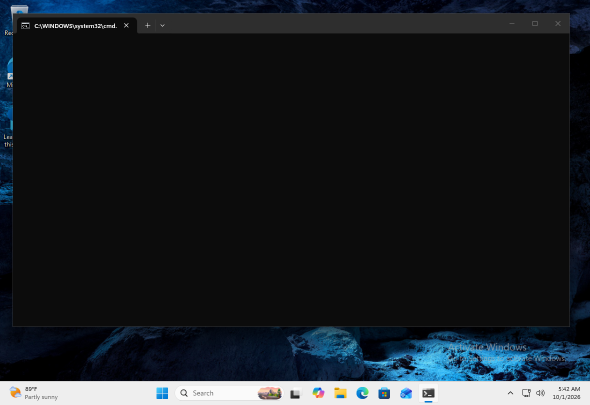</a> |
| TestSessionNotificationsOff | PASS <a href="screens/vm-conformance/irgo-win11/TestSessionNotificationsOff.png">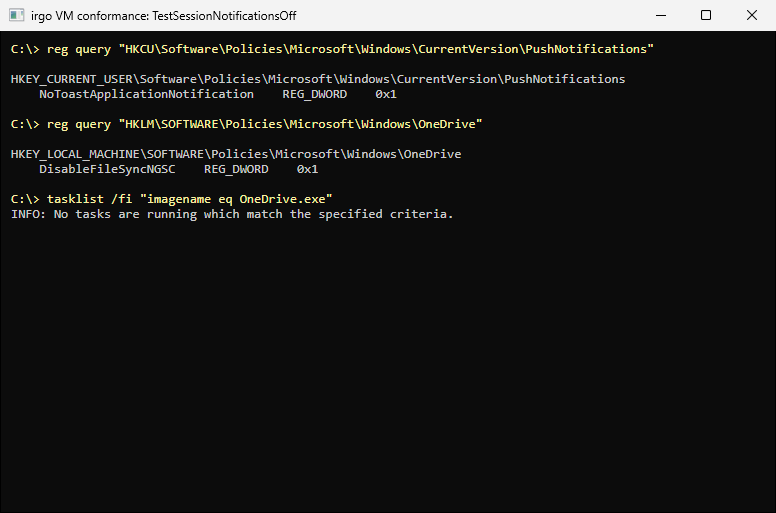</a> |
| TestSessionWebView2Renders | PASS <a href="screens/vm-conformance/irgo-win11/TestSessionWebView2Renders.png">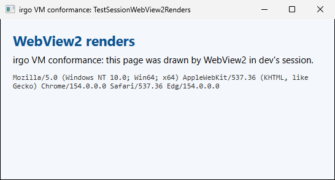</a> |
| TestSessionEvidence/WindowsBuild | PASS <a href="screens/vm-conformance/irgo-win11/TestSessionEvidence_WindowsBuild.png">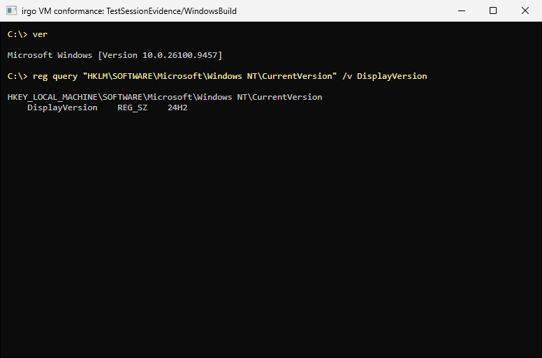</a> |
| TestSessionEvidence/WindowsUpdatePolicy | PASS <a href="screens/vm-conformance/irgo-win11/TestSessionEvidence_WindowsUpdatePolicy.png">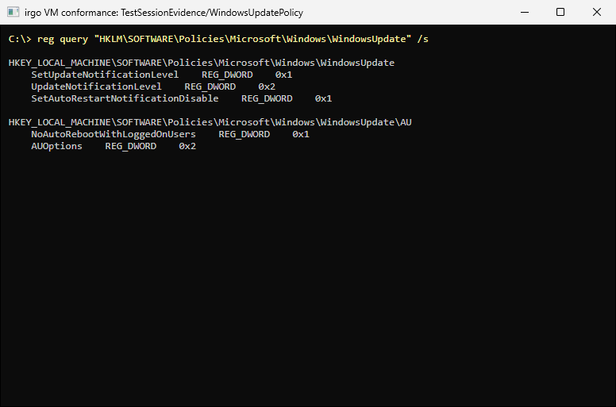</a> |
| TestSessionEvidence/WindowsKeys | PASS <a href="screens/vm-conformance/irgo-win11/TestSessionEvidence_WindowsKeys.png">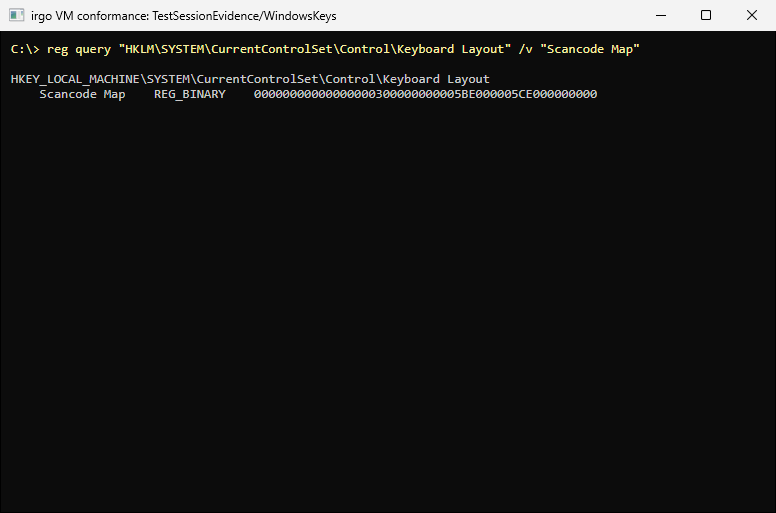</a> |
| TestSessionEvidence/DeviceEncryption | PASS <a href="screens/vm-conformance/irgo-win11/TestSessionEvidence_DeviceEncryption.png">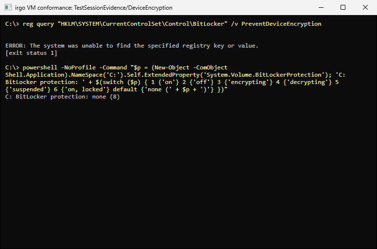</a> |
| TestSessionEvidence/Hibernation | PASS <a href="screens/vm-conformance/irgo-win11/TestSessionEvidence_Hibernation.png">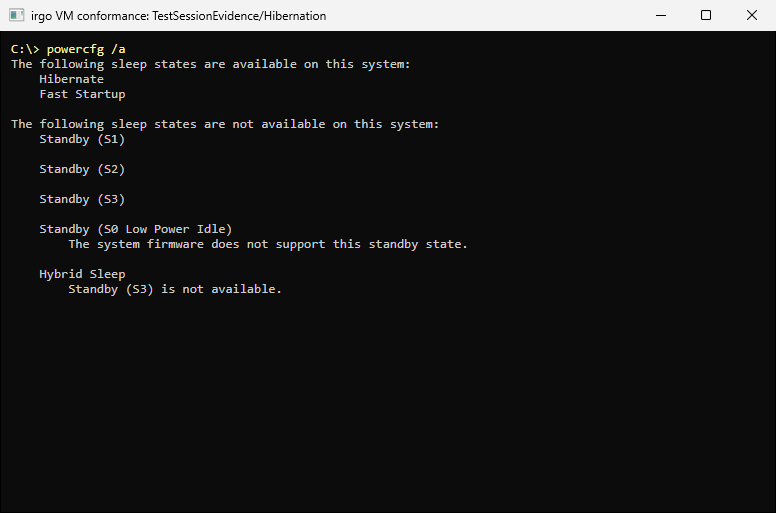</a> |
| TestSessionEvidence/NeverSleeps | PASS <a href="screens/vm-conformance/irgo-win11/TestSessionEvidence_NeverSleeps.png">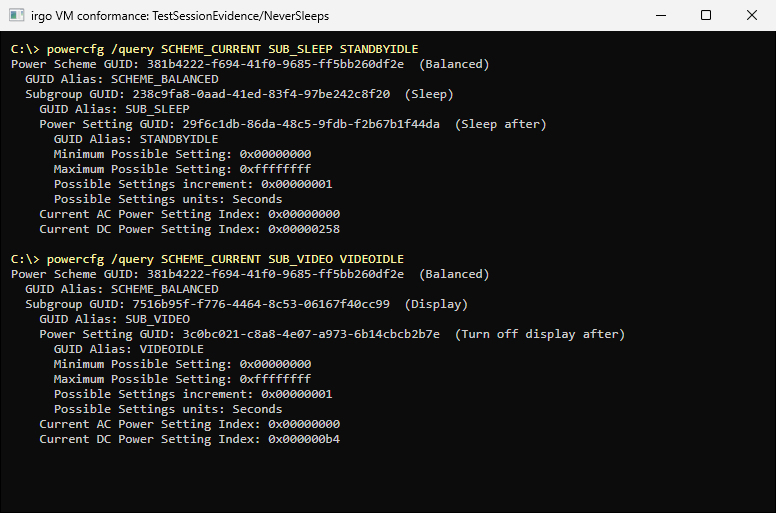</a> |
| TestSessionEvidence/FileShare | PASS <a href="screens/vm-conformance/irgo-win11/TestSessionEvidence_FileShare.png">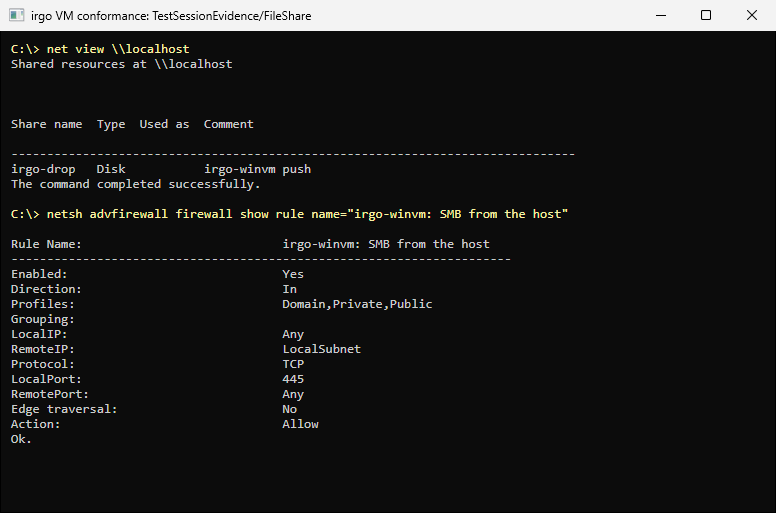</a> |
| TestSessionEvidence/WebView2 | PASS <a href="screens/vm-conformance/irgo-win11/TestSessionEvidence_WebView2.png">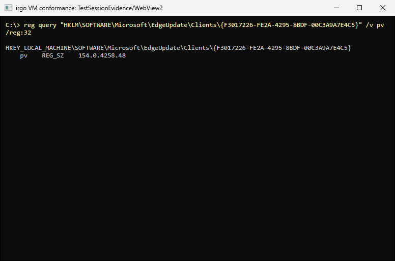</a> |
| Host/DesktopClean | PASS <a href="screens/vm-conformance/irgo-win11/Host_DesktopClean.png">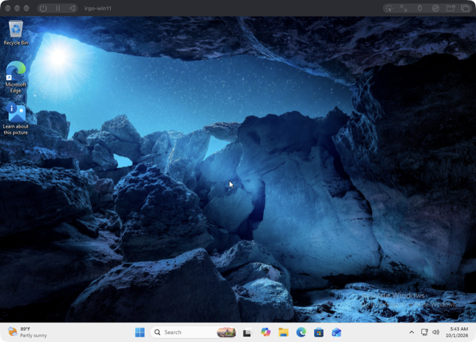</a> the whole VM, photographed from the host with vm-screen after the check |
